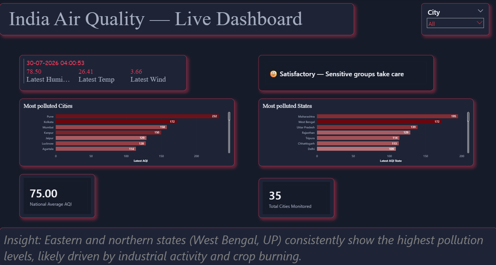
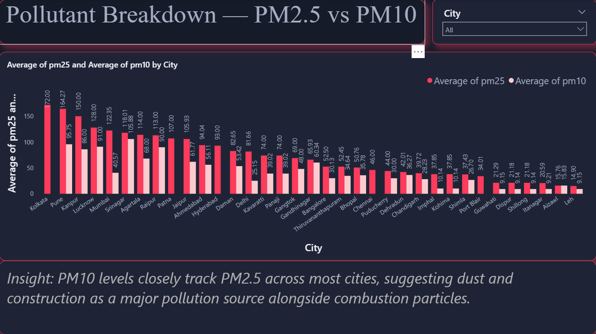
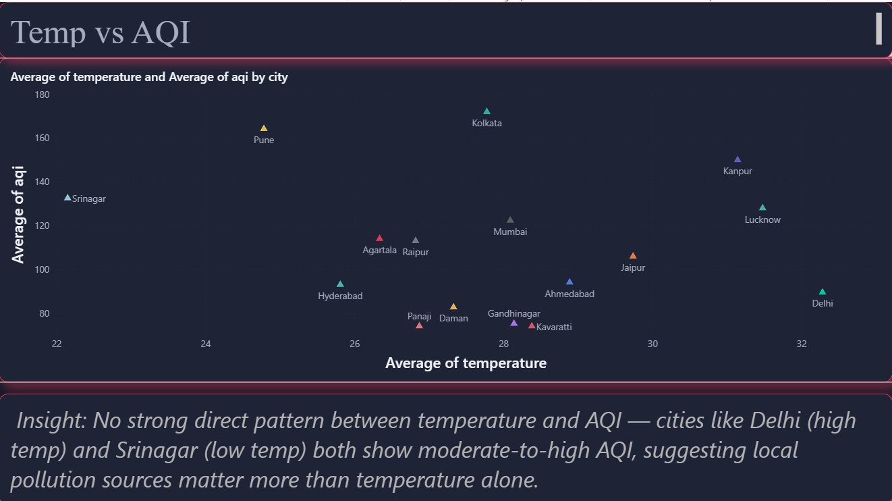
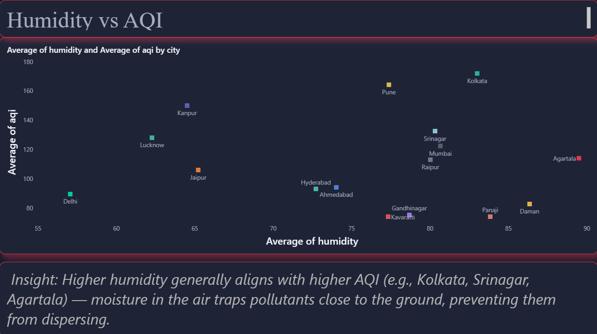
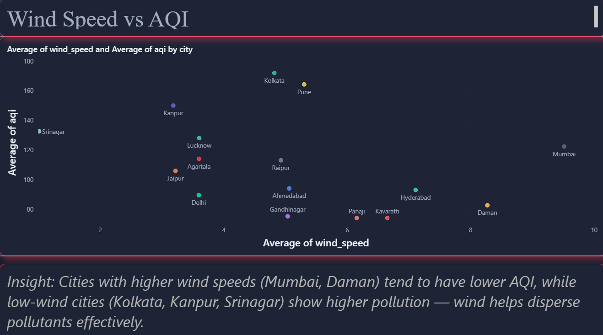
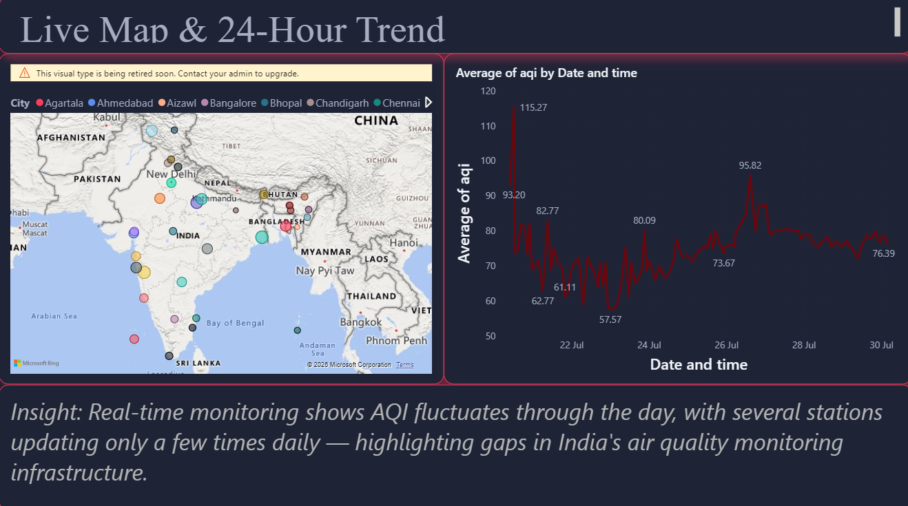

# AQI-dashboard-project

**A real-time India Air Quality dashboard** built with Python, GitHub Actions, and Power BI — tracking live AQI, PM2.5/PM10, and weather correlation across 38 major Indian cities.



## Overview

This project automatically collects live air quality and weather data for 38 major Indian cities every 30 minutes, and visualizes it through an interactive, auto-refreshing Power BI dashboard. It was built to explore how pollution levels relate to weather conditions across India, and to practice end-to-end data pipeline design — from API ingestion to cloud automation to visualization.

## Tech Stack

- **Python** — data collection script with retry/fallback logic
- **WAQI API** (aqicn.org) — live AQI, PM2.5, PM10 data
- **OpenWeatherMap API** — temperature, humidity, wind speed data
- **GitHub Actions** — cloud-based scheduling (runs every 30 minutes, independent of any local machine)
- **Power BI** — dashboard visualization, DAX measures, custom theming

## Architecture

```
GitHub Actions (runs every 30 min)
        ↓
Python script fetches live data from WAQI + OpenWeatherMap
        ↓
Data appended to aqi_data.csv (committed back to repo)
        ↓
Power BI dashboard refreshes from CSV
```

## Features

- 24-hour and 7-day AQI trend chart
- PM2.5 vs PM10 comparison across cities
- Temperature, humidity, and wind speed correlation with AQI
- Most polluted cities and states (ranked)
- Live health advisory card, synced with a city selector
- Live weather snapshot (temperature, humidity, wind, condition icon)
- Interactive India map with city-wise AQI markers
- Custom dark theme for a polished, presentation-ready look

## Dashboard Preview

**Pollutant Breakdown (PM2.5 vs PM10)**


**Temperature vs AQI**


**Humidity vs AQI**


**Wind Speed vs AQI**


**Live Map & 24-Hour Trend**


## Key Insights

- Eastern and northern states (West Bengal, Uttar Pradesh) consistently show the highest pollution levels, likely driven by industrial activity and crop burning.
- PM10 levels closely track PM2.5 across most cities, suggesting dust and construction as a major pollution source alongside combustion particles.
- Higher humidity generally aligns with higher AQI — moisture in the air traps pollutants close to the ground.
- Cities with higher wind speeds tend to have lower AQI, since wind helps disperse pollutants effectively.
- No strong direct relationship between temperature and AQI — local pollution sources matter more than temperature alone.

## Challenges Faced

- **API activation delay**: A newly generated OpenWeatherMap key returned a 401 error before activating — resolved by waiting and re-testing.
- **Timestamp bug**: GitHub Actions runs on UTC servers, causing incorrect timestamps — fixed by converting all timestamps to IST in the script.
- **Date locale parsing**: Power BI was misreading DD-MM-YYYY dates as the US MM-DD-YYYY format — fixed with explicit locale settings during import.
- **Average vs Latest AQI mismatch**: Charts using averaged AQI didn't match live numbers on other platforms (e.g., Google) for some cities, since averaging pulls in occasional spikes — switched key visuals to "Latest reading" measures instead of averages for a more accurate live snapshot.
- **Cross-platform AQI differences**: Even with correct city/location, AQI values sometimes differ slightly from other sources — this is expected, since different platforms may pull from different monitoring stations or use different AQI calculation standards. All data here is sourced live via the WAQI API.

## Data Source Note

Live data is sourced directly from the WAQI (aqicn.org) and OpenWeatherMap APIs. Values may vary slightly from other platforms due to differences in monitoring stations or AQI calculation methodology.

## Files in this Repo

| File | Description |
|---|---|
| `aqi_data_collector.py` | Python script that pulls live AQI + weather data and writes to CSV |
| `.github/workflows/` | GitHub Actions workflow for automated data collection every 30 min |
| `aqi_data.csv` | Collected live data (city, AQI, PM2.5, PM10, temperature, humidity, wind speed, timestamp) |
| `Weather api.pbip` | Power BI dashboard file (Power BI Project format) |
| `WEATHER/Screenshots/` | Dashboard preview images |
